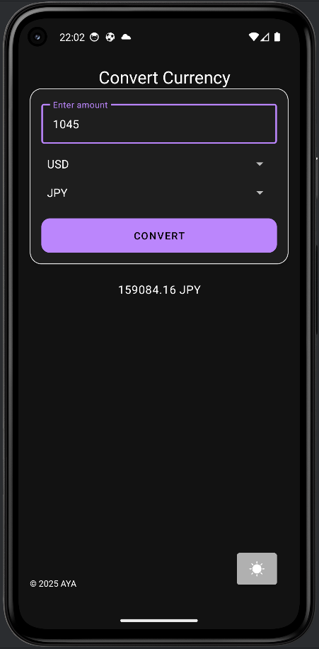
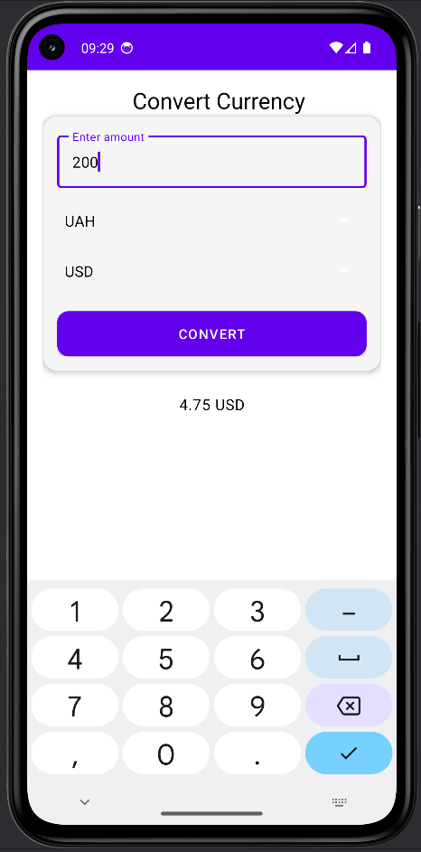
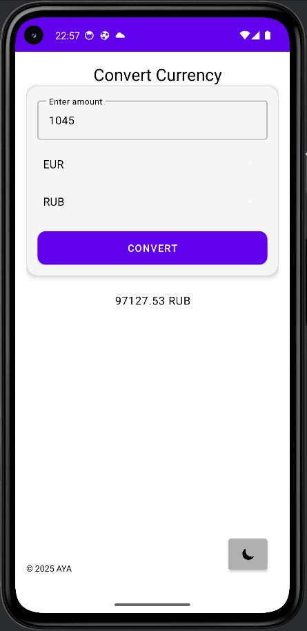

# Currency Converter

🚀 **Современное мобильное приложение** для конвертации валют с поддержкой светлой/тёмной темы.

## 📱 Скриншоты

### Светлая тема


### Тёмная тема


### Анимация смены темы


## ✨ Особенности

- **Реальные курсы валют** через OpenExchangeRates API
- **Сохранение состояния** при смене темы (результат не пропадает!)
- **Material Design 3** — современный UI
- **MVVM + LiveData** — архитектура для масштабирования
- **Тёмная/светлая тема** с кастомными спиннерами
- **Кастомные адаптеры** для выпадающих списков (видны в обеих темах)

## 🛠 Технологии

- **Java 17** + **Android SDK 35**
- **Retrofit 2.11** + **OkHttp** для API
- **Gson** для JSON
- **Material Components** для UI
- **Lifecycle ViewModel/LiveData** для MVVM
- **SharedPreferences** для хранения состояния

## 🔧 Установка

1. **Клонируй репозиторий:**
   ```bash
   git clone https://github.com/YuriyAntropov/CurrencyConverter.git
   cd CurrencyConverter

Добавь API-ключ в local.properties:
api.key=твой_ключ_openexchangerates

Открой в Android Studio и запусти!

📝 API
Используется OpenExchangeRates — бесплатный API для курсов валют.
🎨 Кастомизация

Цвета — в res/values/colors.xml и res/values-night/colors.xml
Лейауты спиннеров — res/layout/spinner_item.xml и spinner_dropdown_item.xml
Иконки темы — res/drawable/moon.png и sun.png

🐛 Известные проблемы

Spinner на светлой теме — видны благодаря кастомным лейаутам
Сохранение состояния — работает через SharedPreferences и ViewModel

📱 Совместимость

minSdk: 21 (Android 5.0+)
targetSdk: 35 (Android 15)

📝 Лицензия
MIT — используй свободно!

Автор: Юрий Антропов
Дата: Октябрь 2025